# 编译器前端部分
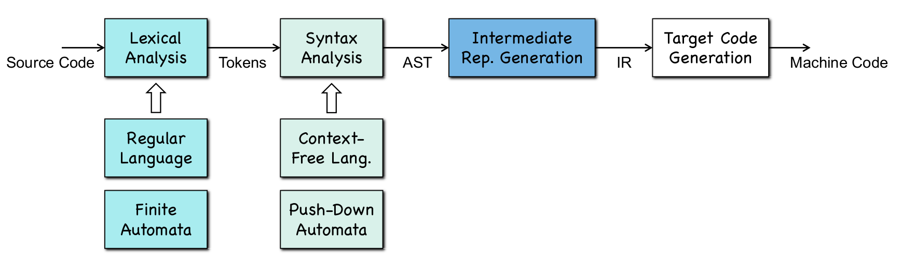
## 正则语言 -> 非确定性状态机 -> 最小确定性状态机

### 正则表达式和正则语言
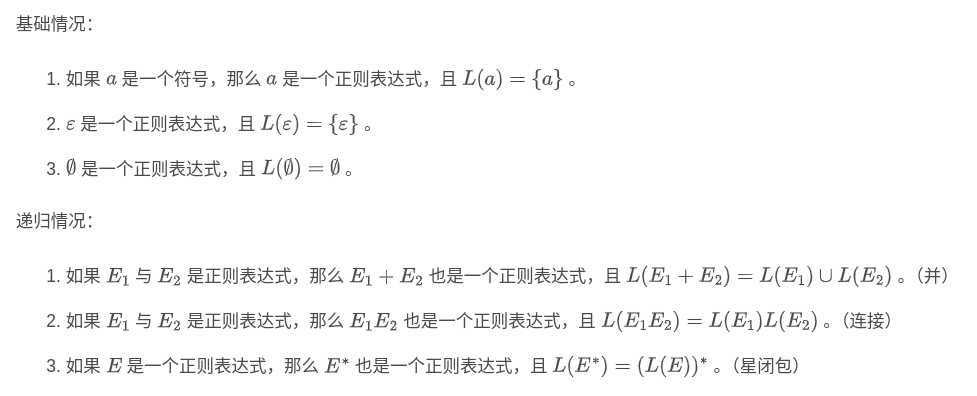

$\phi$表示终结符, $\epsilon$表示空字符


### 从正则语言到非确定性状态机的算法
基本情况 *双圈表示终止状态, 也称为接受状态*
1. $\epsilon$是正则表达式
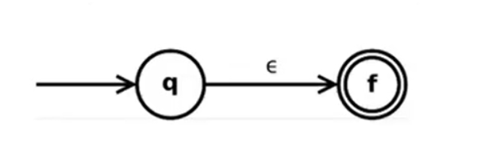
2. $a \in \Sigma$是正则表达式, $\Sigma$表示字母表
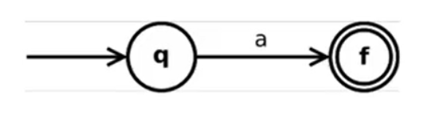
3. 如果$s$, $t$ 是正则表达式, 那么$s | t$是正则表达式
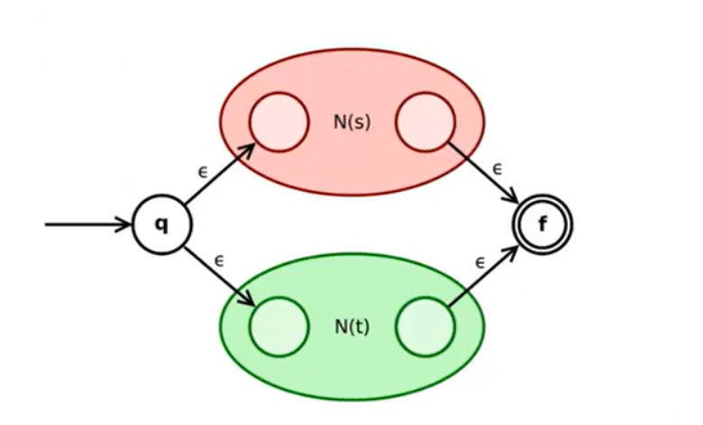
4. 如果$s$, $t$ 是正则表达式, 那么$st$是正则表达式
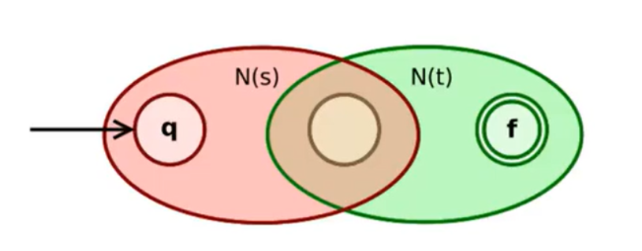
5. 如果$s$ 是正则表达式, 那么$s^*$是正则表达式
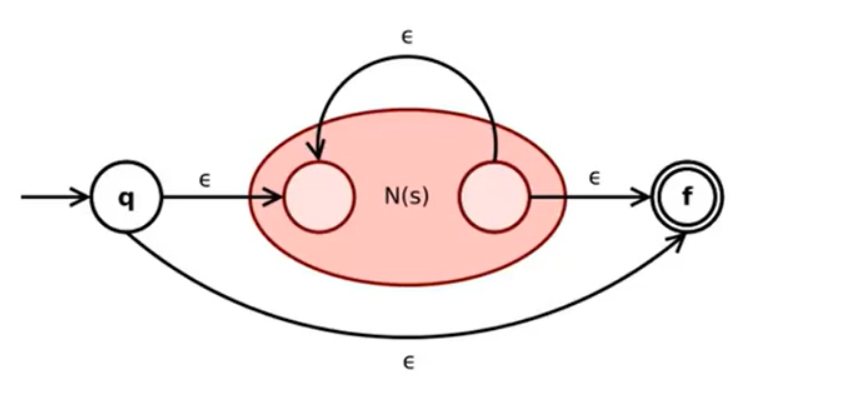


按以上四种情况递归推导
> $r = (a|b)^*abb$
> 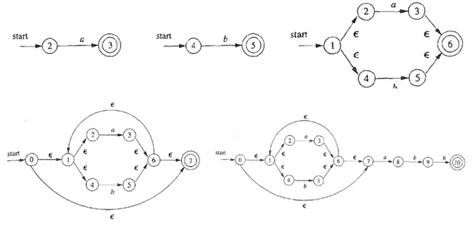

### 从非确定性状态机到确定性状态机
基本概念
1. NFA: 非确定性有限状态机, 当前状态下, 在一个字符的驱动下可以转移到两个（或多个）不同状态, 允许空字符转移
2. DFA: 确定性有限状态机, 一个字符只能转移到唯一确定的下一个状态, 不允许空字符转移

NFA -> DFA **子集构造法**: 用 DFA 模拟 NFA, 通过不断模拟走一步, 来合并所有等价的状态.
1. 确定DFA的初始状态: 是NFA中start指向的状态, **及能经过空字符转移得到的状态**
2. 遍历当前状态下的所有可能的输入字符$a_i$, 寻找经过$a_i$转移后能得到的状态集合
3. 将这个状态集合作为DFA的一个新的状态集, 并构造相应的状态转移
4. 返回第2步重复, 直到不再有新的状态
5. 最后标注终止状态, 为NFA中终止状态所在的状态集, DFA中可能有多个终止状态

> 例题
> 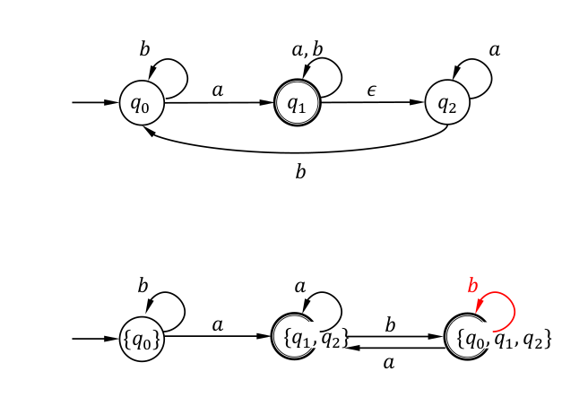
### 最小化确定性状态机
为什么要最小化确定性状态机: 可以提升计算效率, 对于设计词法分析器很有意义

核心思想: 等价的状态可以合并
1. 将所有状态进行初始划分, 初始时, 所有的接受状态和所有非接受状态天然不等价, 故作为状态集合的初始划分
2. 遍历所有可能的输入, 如果该输入导致原本处于同一个等价类的状态$s$和$t$转移到了不同的等价类, 则进行一次划分, 将$s$和$t$所在的等价类分为两份, 如此重复, 直到再也无法对任何等价类进行划分
3. 剩下的同一等价类里若有多个状态, 则它们就是等价状态, 将它们合并

> 例题
> 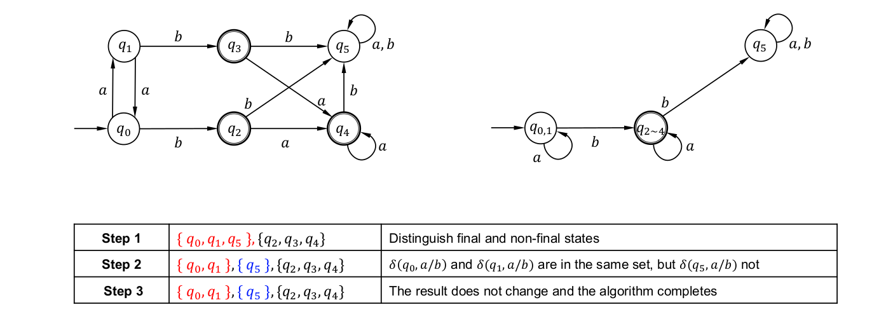

## 上下文无关语法(CFG)和语法分析

### 上下文无关语法(CFG)
定义CFG为一个四元组$G=(V, T, S, P)$
- $T$是CFG所要定义语言的字母表, 称为终结符
- $V$是一个有限的其他符号的集合, 每个符号代表了一个语言, 称为变量或非终结符
- $S$是代表CFG所要定义的语言变量, 称为起始符号
- $P$是产生式的集合, 表示语言的递归定义, 每个产生式形如$head \rightarrow body$
  - head是一个变量
  - body是变量和终结符组成的字符串, 可以是空串

> 例
> $a^nb^n$的CFG为$S \rightarrow aSb | \epsilon$


### 推导
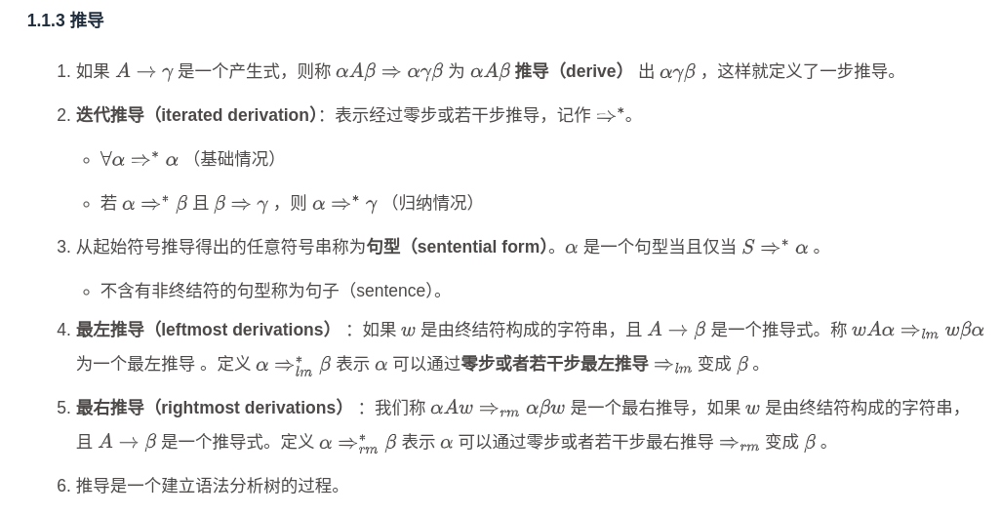

### 构建语法分析树
递归下降语法分析
1. 消除左递归

> 左递归是指在上下文无关文法（CFG）的产生式中，某个非终结符在其产生式右部的最左侧再次出现自身
>
> A → Aα | β

如果文法中存在左递归, 递归下降分析时会陷入无限递归

如何消除左递归
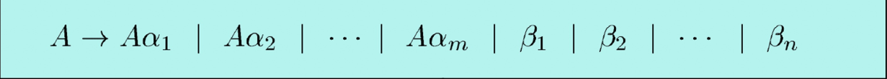
改写为
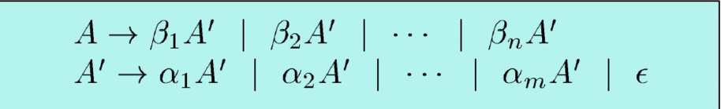

> 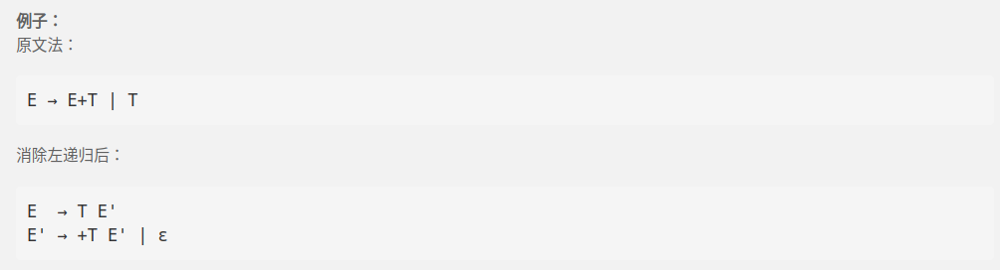

2. 构建预测表减少回溯

在语法分析中如果一个产生式无效, 我们需要尝试其他的产生式, 因此需要回溯

LL(1)文法:
- 第一个 L：表示从左到右扫描输入串（Left to right）
- 第二个 L：表示使用最左推导（Leftmost derivation）
- 1：表示每一步只看一个输入符号作为前瞻
是一个没有歧义, 没有左递归的文法

为了构建预测表, 需要计算First()和Follow()

$First(\alpha)$: 符号串$\alpha$能推导出的第一个终结符的集合

$Follow(\alpha)$: 在某个句型中, 紧跟在非终结符$\alpha$后面可能出现的终结符集合, $\$ \in Follow(S)$
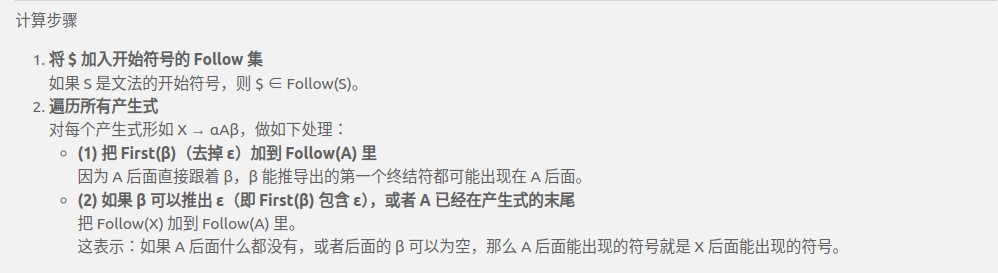
**注意$\beta$能推出$\epsilon$的情况**

有了First和Follow就可以构建预测表
1. 初始化构建一个二维表, 行是非终结符, 列是终结符(包括$)
2. 遍历每个产生式$A \rightarrow a$
   1. 对First(a)中的每个终结符t, 在表的[A, t]位置填入产生式$A \rightarrow a$
   2. 如果$\epsilon \in First(a)$ 则对Follow(A)中的每个终结符t, 在表的[A, t]位置也填入产生式 $A \rightarrow a$
   3. 如果$\epsilon \in First(a)$ 且 $\$ \in Follow(A)$, 则在[A, $]位置也填入 $A \rightarrow a$

>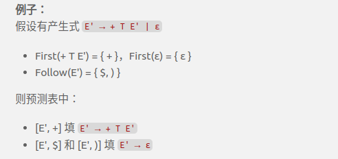


## IR的生成

### 写出对应代码的三地址码
三地址码: 每条指令的右侧最多只有一个操作符 / 每条指令最多只能有3个地址
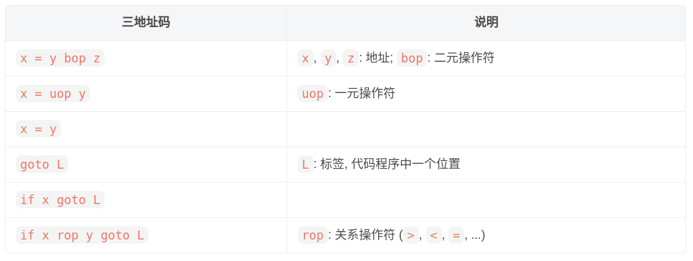

三地址码的表示方式
1. 四元式 ```op arg1 arg2 result```
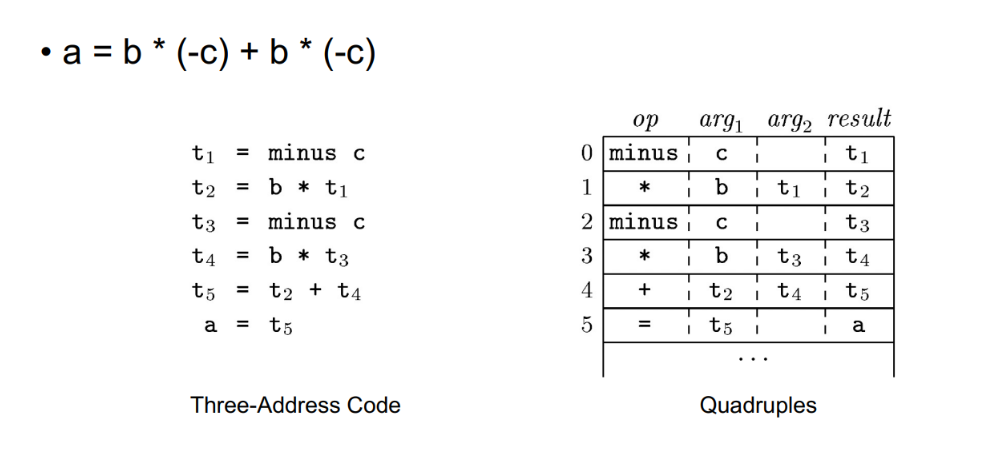
2. 三元式: 与四元式相比，不引入临时变量存放运算结果，而是用指令的位置来表示指令的运算结果 ```op arg1 arg2```
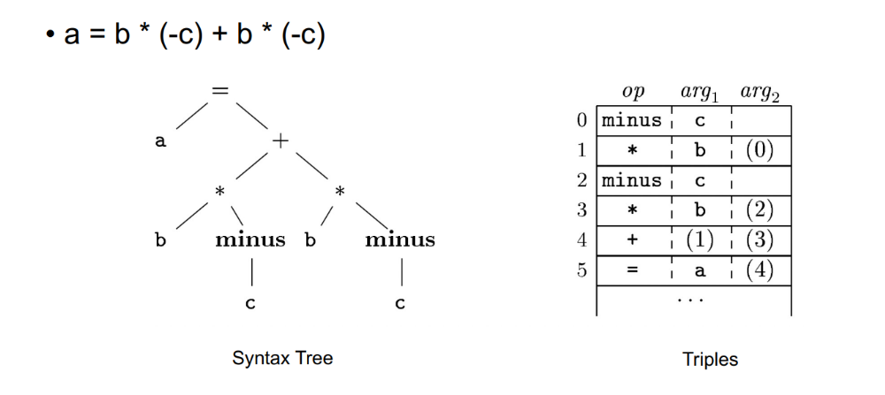
3. 间接三元式: 包括一个直接三元式列表，一个指向每一个直接三元式的指针列表 instruction, 这样做的好处是方便优化器重新排列 instruction 列表的元素顺序，却并不需要修改任何一个三元式本身
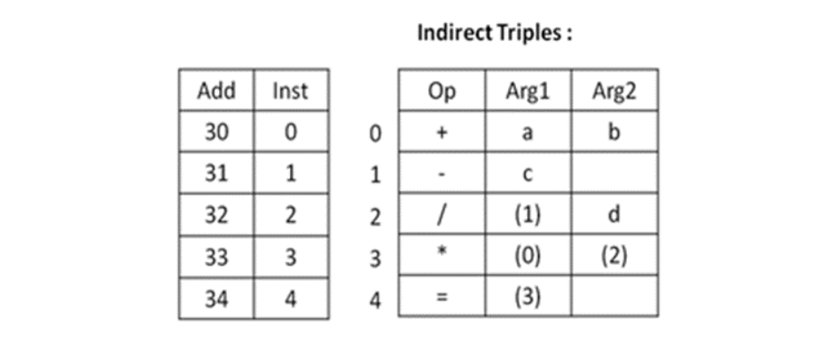


### SSA(静态单赋值)
- 每个变量在程序中只被赋值一次, 同一个变量需要多次赋值时, 会用不同的名字区分
- 当有多个控制流分支时, 会引入$\phi$函数来合并不同分支的变量
- 变量的赋值和使用关系非常清楚

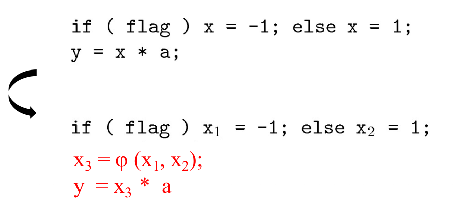


### 支配关系
1. A dom B 表示从入口到B基本块一定经过A
2. A post-dom B 表示从B基本块到终止一定经过A
3. 严格支配/严格后支配 要求$A \not= B$
4. 立即支配 要求 A严格支配B, 且A和B之间没有其他的基本块

### 支配树
- 节点表示基本块
- 边表示立即支配关系
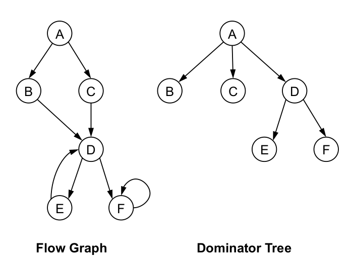

为什么会是一棵树: 是因为每个基本块（除入口块）都有唯一的“立即支配者”，即在控制流图中，从入口到该基本块的所有路径都必须经过它的立即支配者，并且没有其他基本块更“接近”它

### 支配前沿
- 是被B支配的基本块的直接后继基本块
- 且不会被B严格支配
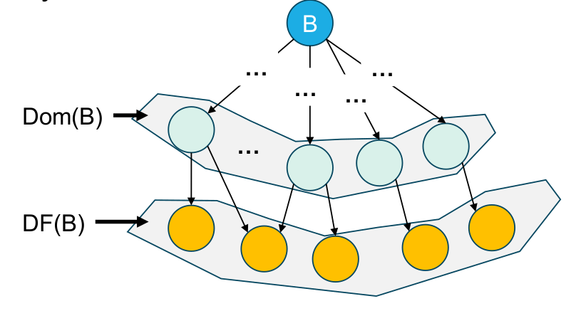

基本块集合的支配前沿: 就是把集合中每一个基本块的支配前沿取并集

迭代的支配前沿: 将基本块集合的支配前沿和基本块集合合并, 作为新的基本块集合, 继续取并集, 直到没有新的基本块加入