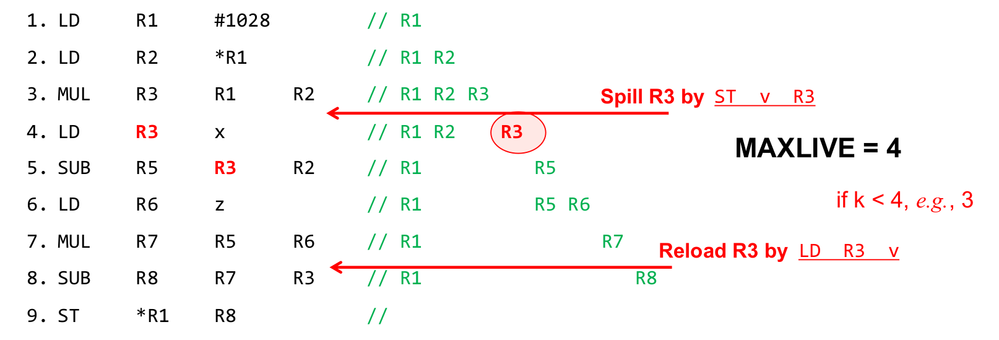
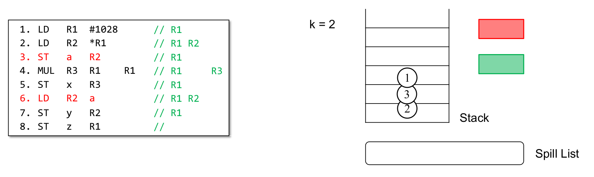
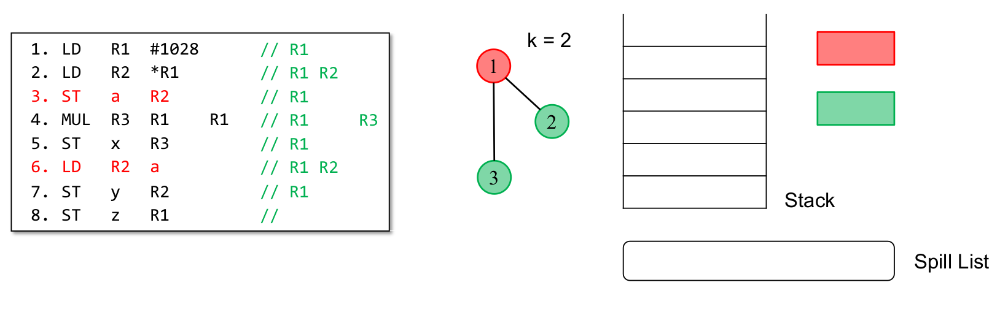
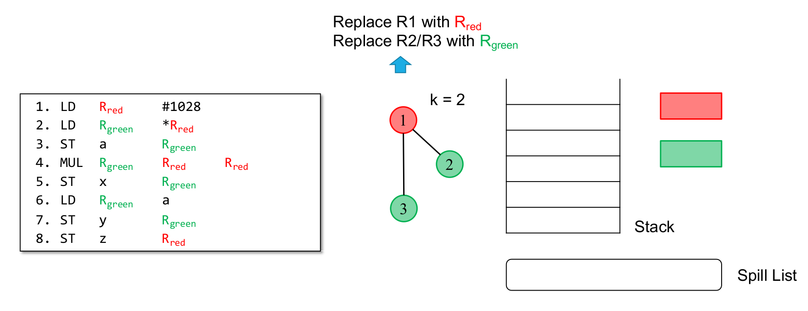

# 编译器后端

## 指令选择
将三地址码转换为汇编指令

指令分为三类

有五种寻址模式
1. LD R1, a(R2): 将内存地址为 a + R2 的内容加载到R1
2. LD R1, 100(R2): 将内存地址为 100 + R2 的内容加载到R1
3. LD R1, *R2: 取出R2的内容, 将其作为地址, 再从该地址指向的内存中取出内容加载到R1
4. LD R1, *100(R2): 先计算 100 + R2, 取计算得到的内容作为新地址, 再用新地址指向的内存中取出内容加载到R1
5. LD R1, #100: 将常数100 直接加载到R1

## 寄存器分配
为什么需要寄存器分配
1. **寄存器数量有限**：大多数CPU只有少量通用寄存器，无法为每个变量都分配一个寄存器。
2. **提升程序运行效率**：寄存器访问速度远快于内存，合理分配寄存器可以减少内存访问，提高执行效率。
3. **支持并发和函数调用**：需要合理管理寄存器，避免不同函数或线程间的冲突和数据丢失。
4. **满足指令约束**：某些指令要求操作数必须在寄存器中，必须进行寄存器分配。

局部寄存器分配: 只在单个基本块内分配寄存器, 不考虑基本块之间的变量活跃情况

全局寄存器分配: 在整个函数甚至程序范围内分配寄存器, 需要分析变量跨基本块的活跃情况

什么是溢出

**溢出（Spilling）**指的是：  
当可用寄存器数量不足，无法为所有活跃变量分配寄存器时，**需要把部分变量的值临时存放到内存（通常是栈）中**，这就是溢出。

- 被溢出的变量在需要用到时再从内存加载回寄存器。
- 溢出会导致额外的内存读写，降低程序性能。

溢出是寄存器分配中的常见问题，编译器会尽量减少溢出的发生。

### 局部寄存器分配
步骤
1. 计算MAXLIVE: 在基本块执行过程中, 同时活跃的变量的最大数量
2. 如果MAXLIVE <= k(寄存器数量)...
3. 如果MAXLIVE > k ...

MAXLIVE <= k情况

MAXLIVE > k情况, 需要溢出

### 全局寄存器分配
K着色问题
- 构建一个冲突图Conflict Graph
- 图的每个节点代表一个变量
- 如果两个变量在某一时刻同时活跃, 就在它们之间连一条线, 表示不能分配到同一寄存器
- 用K种颜色(对应K个寄存器)给图的每个节点着色, 使得任意相邻节点颜色不同
- 如果能成功着色, 说明所有变量都能分配到寄存器, 否则需要溢出

#### Chaitin算法
算法步骤
1. 反复移除度小于K的节点并入栈, 直到图为空或只剩度大于K的节点
2. 然后出栈着色, 若遇到无法着色的节点标记为溢出

## 指令调度
为什么要进行指令调度
- 现代高性能处理器通常能在一个时钟周期内执行多条指令（如流水线、超标量、乱序执行等）。
- 如果不合理安排指令顺序，可能会导致处理器资源空闲、流水线停顿、数据相关冲突等，降低执行效率。
- 通过指令调度，可以最大化指令级并行性（ILP），减少等待和冲突，让处理器各单元尽可能“满负荷”工作，从而提升程序运行速度。

为什么编译器那么重要
- 硬件只能执行已经取到的指令，取不到的指令无法并行执行。
- 硬件用于缓存等待（阻塞）操作的空间有限，过多的阻塞会导致资源浪费。
- 编译器可以通过指令调度，把**无依赖的操作尽量安排在一起**，让硬件能更好地利用流水线和并行执行能力，提高整体性能。

### 基本块内部的调度

#### 指令调度的限制

真依赖: 也称为 Read-After-Write 依赖
- 指令B读取某个操作数, 而该操作数由指令A写入
- 必须保证指令A先执行, 指令B后执行

假依赖: 包括反依赖和输出依赖
- 反依赖, 也称为 Write-After-Read 依赖, 指令A读取某个操作数, 指令B随后写入同一个操作数
- 输出依赖, 也称为 Write-After-Write 依赖, 两条指令都写同一个操作数
- 可以通过重命名寄存器, 将不同指令对同一变量的访问映射到不同的物理寄存器, 从而消除假依赖

但寄存器数量是有限的, 指令调度需要用到更多寄存器, 但寄存器分配希望使用最少的寄存器, 这是一个权衡问题

#### 依赖图 Dependence Graph
- 节点: 一条指令
- 边: 真依赖关系

最后在依赖图的节点上标记完成这条指令所需时钟周期, 计算深度

#### 列表调度 List Scheduling
1. 在构建完依赖图后
2. 每个时钟周期后进行检查, 维护一个就绪列表, 其中包含所有当前没有未完成的前驱依赖的指令
3. 每次从就绪列表中选择可以调度的指令, 如果有多条, 按照一定的优先级选择(深度越大优先级越高; 使用资源越多优先级越高)
4. 更新依赖图

